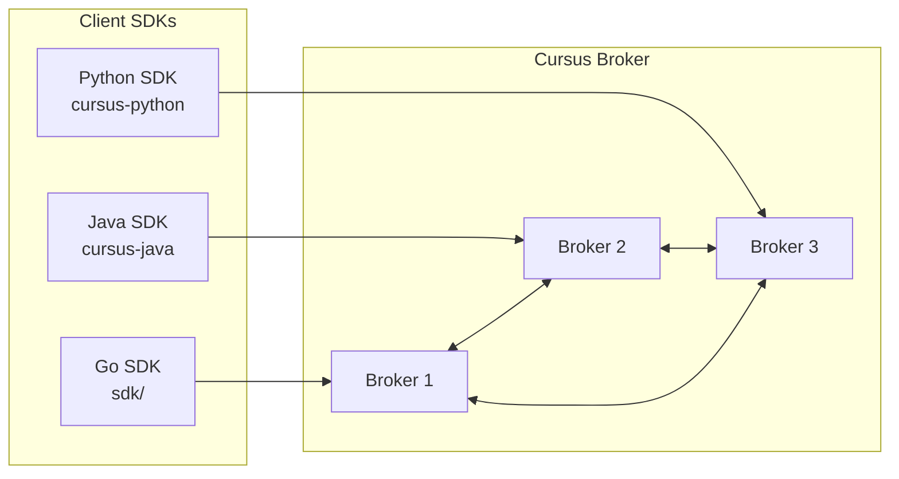
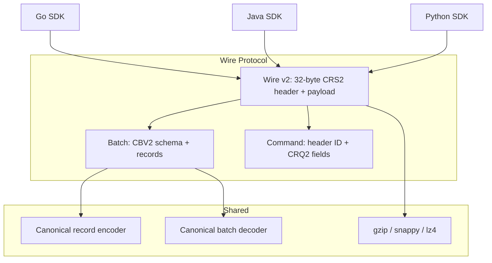
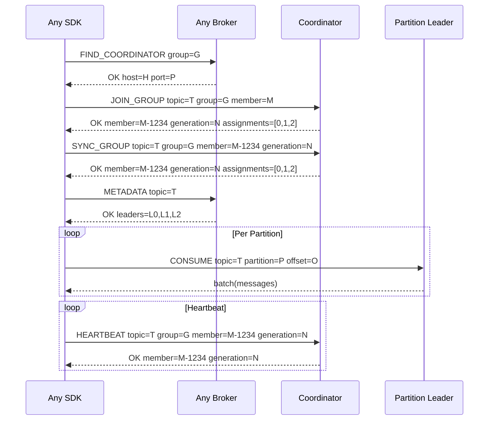

# SDK Overview

Cursus defines one Wire v2 contract. The in-repository Go SDK is changed and tested atomically with the broker. The separately released Java and Python SDKs also implement the required handshake, correlated frames, compression, structured errors, routing, administration, transactions, event sourcing, and framework helpers. This repository does not provide a legacy protocol mode; every SDK release must pass the shared byte-exact conformance fixture and live-broker tests.

## SDK Ecosystem



## Wire Protocol Compatibility

Every supported SDK must implement the same wire protocol:



## Feature Matrix

| Feature | Go SDK | Java SDK | Python SDK |
|---|---|---|---|
| Producer (sync) | ✅ | ✅ | ✅ |
| Producer (async) | — | — | ✅ AsyncProducer |
| Consumer (polling) | ✅ | ✅ | ✅ |
| Consumer (streaming) | ✅ | ✅ | ✅ |
| Consumer Groups | ✅ | ✅ | ✅ |
| EventStore | ✅ | ✅ | ✅ |
| Compression (gzip) | ✅ | ✅ | ✅ |
| Compression (snappy) | ✅ | ✅ | ✅ (extras) |
| Compression (lz4) | ✅ | ✅ | ✅ (extras) |
| TLS | ✅ | ✅ | ✅ |
| FindCoordinator | ✅ | ✅ | ✅ |
| Partition Leader Routing | ✅ | ✅ | ✅ |
| Broker-owned offset resume / `auto_offset_reset` | ✅ | ✅ | ✅ |
| Explicit `read_committed` / `read_uncommitted` | ✅ | ✅ | ✅ |
| Required Wire v2 handshake | ✅ | ✅ | ✅ |
| Typed structured broker errors | ✅ | ✅ | ✅ |
| High-level broker transactions | ✅ | ✅ | ✅ |
| Admin client | ✅ | ✅ | ✅ |
| Event framework and saga helpers | ✅ | ✅ | ✅ |
| Client metrics | ✅ | ✅ | ✅ |
| Connection authentication | ✅ | ✅ | ✅ |
| Framework Integration | — | Spring Boot | FastAPI |
| Iterator Pattern | — | — | ✅ for/async for |

## Go Producer Delivery Errors

`Producer.Flush() error` waits for queued batches and returns a drain timeout or the first permanent delivery failure. `Producer.Close() error` also reports that failure, including when shutdown times out. Check both return values: accepting a message into the local buffer is not proof of broker delivery. Permanent delivery errors remain visible for the lifetime of the producer.

For acknowledged batches, success requires an `OK` acknowledgement matching the batch's producer ID, epoch, and complete sequence range. Read timeouts, incomplete responses, and invalid acknowledgements discard the partition connection before retrying the unchanged batch. `Acks="0"` does not wait for broker acknowledgement and cannot establish delivery.

## Cluster Consumer Routing


## Wire v2 Handshake

Every Go SDK connection performs the required Wire v2 binary handshake before authentication or application requests. Compression is negotiated during this handshake and the temporary deadline is cleared before the request lifecycle begins:

```go
cfg := sdk.NewDefaultConsumerConfig()
cfg.CompressionType = "lz4"
cfg.HandshakeTimeoutMS = 5000
```

The handshake runs for every newly opened or reconnected TCP connection. `HandshakeTimeoutMS` bounds it; zero uses 5000 ms and negative values fail configuration validation. A version or compression mismatch closes the connection before use. The SDK has no application-level feature negotiation or legacy protocol mode.

Go, Java, and Python encode the same canonical conformance vectors for
negotiation, requests, batches, stream controls, errors, and compression. The
fixture protects byte-level compatibility; it does not replace each SDK's
required live-broker producer, consumer, administration, transaction, and
EventStore tests.

Broker failures returned by application requests are available as `*sdk.BrokerError`:

```go
var brokerErr *sdk.BrokerError
if errors.As(err, &brokerErr) {
    if brokerErr.Retryable {
        // Apply bounded backoff or redirect handling before retrying.
    }
}
```

`BrokerError` exposes `Code`, `Class`, `Retryable`, `Fields`, and the raw response. Wire v2 requires explicit `class` and `retryable` fields; unstructured error text is rejected. Typed errors match `ErrTopicNotFound`, `ErrInvalidPartition`, and `ErrNotLeader` through `errors.Is`.

## Go Topic Policy

`Producer.CreateTopic` is the minimal convenience API. Disabled idempotence and unspecified policy values are omitted so repeated provisioning does not clear an existing definition. Use `CreateTopicWithOptions` for an explicit non-zero producer provisioning contract:

```go
err := producer.CreateTopicWithOptions("player-state", sdk.TopicOptions{
    Partitions:     12,
    CleanupPolicy:  sdk.TopicCleanupCompact,
    RetentionHours: 168,
    Partitioner:    "hash_key",
})
```

For administrative create/update flows, use `AdminClient`. `TopicDefinitionPatch` uses pointers so callers can intentionally send zero, false, or an empty ACL while leaving nil fields unchanged:

```go
cfg := sdk.NewDefaultAdminConfig()
cfg.BrokerAddrs = []string{"broker-1:9000", "broker-2:9000", "broker-3:9000"}
admin, err := sdk.NewAdminClient(cfg)
if err != nil {
    return err
}

retentionHours := 0
emptyReaders := []string{}
definition, err := admin.UpdateTopic("player-state", sdk.TopicDefinitionPatch{
    RetentionHours: &retentionHours,
    ReadACL:        &emptyReaders,
})

deleted, err := admin.DeleteTopic("retired-player-state", sdk.DeleteTopicOptions{
    IfExists: true,
})

truncated, err := admin.TruncateTopic("test-player-state", sdk.TruncateTopicOptions{
    ExpectedRevision: definition.Revision,
})
```

`AdminClient` validates values locally, returns the broker's complete `TopicDefinition` for create/update, a `DeleteTopicResult` for delete, and a `TruncateTopicResult` for reset. Attempts are bounded by `MaxRetries + 1` and rotate across configured brokers for retryable routing/availability and pre-submission transport failures. The SDK canonicalizes `compact,delete` to `delete,compact`, enforces the portable topic-name contract, and rejects unsafe command values, zero expected revisions, negative retention, or unknown policy enums before opening a broker connection. Compact policies require a non-event-sourcing application topic; the broker enforces the additional distributed safety gates. `EventStore.CreateTopic` explicitly declares `cleanup_policy=delete`.

`DeleteTopic` and `TruncateTopic` exist only on the admin client; producer and consumer clients do not expose destructive lifecycle methods. `IfExists` makes an explicit deletion retry idempotent; without it, a missing topic returns `topic_not_found`. The admin client retries a dropped connection after command submission only for `IfExists=true`; non-idempotent delete and truncate stop with an unknown-outcome error. A truncate replay cannot erase a second generation because `ExpectedRevision` is mandatory, but a committed first attempt would return a conflict rather than the original result, so the SDK does not hide that ambiguity. `CleanupPending` means the logical lifecycle committed while broker-local storage cleanup is still converging. Kubernetes reconcilers should call delete only for an explicit absent/tombstone resource that crossed a separate approval boundary, and should never emulate truncation with delete-and-create.

## Go Transactional Producer

The Go SDK exposes both the existing low-level transaction commands and a
session-preserving `TransactionalProducer`:

```go
cfg := sdk.NewDefaultConsumerConfig()
cfg.BrokerAddrs = []string{"broker-1:9000", "broker-2:9000"}

client, err := sdk.NewConsumerClient(cfg)
if err != nil {
    return err
}
producer, err := client.NewTransactionalProducer("game-server-events")
if err != nil {
    return err
}
if err := producer.Begin(); err != nil {
    return err
}
if err := producer.Publish("events", -1, sdk.Message{
    SeqNum:  1,
    Key:     "match-42",
    Payload: payload,
}); err != nil {
    _ = producer.Abort()
    return err
}
if err := producer.SendOffsets(
    "events",
    groupID,
    memberID,
    generation,
    map[int]uint64{partition: lastProcessedOffset + 1},
); err != nil {
    _ = producer.Abort()
    return err
}
return producer.Commit()
```

The broker allocates and fences the producer ID and epoch. The high-level
producer retains that session across reconnects and serializes lifecycle calls.
A successful `Commit` or `Abort` consumes the current epoch; the next `Begin`
automatically reinitializes the session and obtains a higher epoch. Retrying an
uncertain finalization continues to use the same epoch, preserving idempotency. Once the broker reports `state=committing`, retry `Commit`; do not switch that epoch to abort.

`NOT_COORDINATOR` responses update a per-transaction coordinator cache and are
retried with a bounded delay. Fencing, authorization, validation, and ambiguous
network failures are returned to the caller as errors rather than retried. The
broker is authoritative for final transaction state; `Describe` returns the
typed state, message count, and offset count.

One transaction may publish to multiple output partitions, but staged consumer
offsets must share one `(topic, group, member, generation)` scope. Duplicate
partition entries merge monotonically and the scope commits through one fenced
bulk offset update. Use separate transactions for separate consumer scopes.

Commit writes idempotent output records, appends partition transaction markers,
applies the bulk source offset update, then persists the final coordinator
decision. `read_committed` requires both marker and decision, so output stays
hidden during a recoverable crash window before finalization.

## Go Consumer Resume Contract

The Go consumer fetches the broker-owned committed `nextOffset` after
assignment and rejoin. Applications that commit after processing should commit
`lastProcessedOffset + 1`. Reconnects roll back the local fetch position to the
last broker-committed offset, providing at-least-once processing.

`AutoOffsetResetEarliest` and `AutoOffsetResetLatest` are sent as
`autoOffsetReset=earliest|latest` in polling and streaming commands.
`AutoOffsetResetError` leaves reset selection disabled and surfaces an
out-of-range condition.

After each metadata refresh the consumer records whether the authoritative
`cleanup_policy` includes `compact`. Forward jumps on such a topic are valid
logical holes and increment
`cursus_consumer_compacted_offsets_skipped_total{topic,group}`; they do not
increment `cursus_consumer_offset_gap_total`. The same jump on a non-compacted
topic remains an unexpected offset gap. Missing or invalid cleanup policy
metadata clears the compaction classification instead of weakening gap
detection.

`ConsumerConfig.ReadIsolation` selects `sdk.ReadCommitted` or
`sdk.ReadUncommitted`; the default is `ReadCommitted`. The SDK sends the value
explicitly on both `CONSUME` and `STREAM`. Committed reads expose
non-transactional records and transaction records only after both the matching
partition marker and final coordinator decision are durable. They skip aborted
transactions and stop at the earliest unresolved transaction. Uncommitted reads
return the raw committed partition log, including transaction control records.

## Go Client Authentication

Publisher and consumer configs accept connection credentials:

```go
cfg.Principal = "game-server"
cfg.AuthToken = os.Getenv("CURSUS_AUTH_TOKEN")
```

When both fields are set, every new or reconnected SDK connection performs
`AUTH principal=<principal> token=<token>` after protocol negotiation and
before application commands. The two fields must be configured together.
Authentication and authorization failures are returned as typed
`*sdk.BrokerError` values. TLS remains required when credentials cross an
untrusted network.
